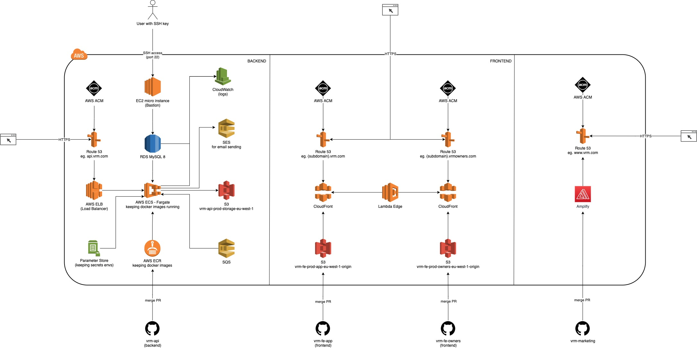

## Requirements

- Docker
- node >=15.0.0
- npm >=7.0.0

## Extra Requirements

- [AWS CLI](https://docs.aws.amazon.com/cli/latest/userguide/install-cliv2-mac.html)

## Setup

- Copy the environment skeleton `cp .env.dist .env`
- Replace the values with your configuration in `.env` (Ask for it).
- `npm install`

## Run

On host:

- `npm run dev`
- `docker-compose up --build -d --remove-orphans db`

- `npm run knex -- migrate:latest`
- `npm run knex -- seed:run`

* in `.env` file you should have `DATABASE_HOST=localhost`

In docker:

- `docker-compose up`
- `docker-compose run migration /bin/sh -c "npm run knex -- migrate:latest"`
- `docker-compose run migration /bin/sh -c "npm run knex -- seed:run"`

* in `.env` file you should have `DATABASE_HOST=db0`

## Generate Swagger Documentation

`npm run swagger -- -d swagger.yaml ./src/handlers/api/**/*.js -o docs/api.yaml &>/dev/null`

## Tasks

To execute a task runner, you should execute a command: `npm run task -- {TASK_NAME} {PARAM_1} {PARAM_2}`

Available tasks:

- `exchangerateapi` - populate currencies
- `stripe set fixtures` - populate plans & prices to stripe

## Troubleshoots

If you have a problem with setup the application with docker please follow the steps below:

- Remove `node_modules` directory
- Cleanup docker data:

```
# stop all containers
docker kill $(docker ps -q)

# remove all containers
docker rm $(docker ps -a -q)

# remove all docker images
docker rmi $(docker images -q)

# prune docker data
docker system prune -a -f --volumes
```

- Build docker images: `docker-compose up --build`

## Structure

[/src](/src)

This is where the main app lives. All files related to the code base of the application should live in here to simplify the extraction of the app (e.g. containerizing).

[/bin](/bin)

This folder includes all executable system files.

[/config](/config)

This folder includes all the config parts for the app. Every stage has its own config file and can override the default. Config values based on the environment or secrets should be referenced as environment variables.

[/tasks](/tasks)

This folder includes command line tasks dispatched mostly by cron-job

[/src/middlewares](/src/middlewares)

A place where are located all typical express middlewares.

[/src/models](/src/models)

This is where all database schema are located.

[/src/handlers](/src/handlers)

This is where all the handlers including the route definitions go. Be sure that the structure of the directories and name of the file represent the calls to the REST resources (e.g. `GET /user/investments` should live in `src/handlers/user/investments/list.js`).

[/src/services](/src/services)

This folder includes mostly adapter functions about common functionality used in the app (e.g. reading and writing files, getting data from a third party service, logging).

## Stripe

#### Debug Stripe webhooks

Setup:

`stripe login`
`stripe listen --forward-to localhost:3000/webhooks/stripe`
`stripe logs tail`

A test request:

`stripe trigger payment_intent.created`

## Third-Party services

1. [Stripe](https://www.stripe.com/) - Payments, billing system & payments for our customers
2. [Channex.io](https://channex.io/) - Channel manager
3. [Nexmo](https://developer.nexmo.com/) - Phone Calls & Messages
4. [Exchangerates](https://exchangeratesapi.io/) - Exchange Rates Api for currency rates
5. [Sentry](https://sentry.io/) - Bug tracker & monitoring

## Hooks

During `npm install`, the `husky` package will enable the following hooks:

- Check for linting before each commit

## Diagrams

### Infrastructure



## Contribute

1. Make your code changes
2. Update the version according to semantic versioning in [/VERSION](/VERSION)
3. Update the postman collection if you made any changes to the API in [/docs/postman/collection.json](/docs/postman/collection.json)
